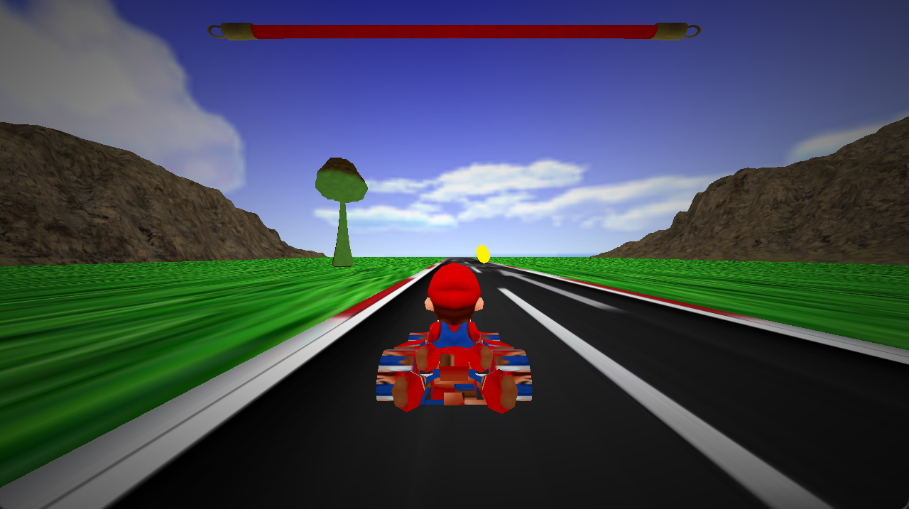

# Crash Super Mario
🚗 Super Mario is a 3D Car Race game, you have a road fall of coins and bombs and you try to earn score as much as you can

# Tools
- C++
- OpenGl v3.3
- cmake
- GLSL

# How to bulid
- Install VS code
- Install CMake & CMake Tools Extensions
- Select Ctrl + P
- Type ' > cmake: select kit'
- Select 'visual studio community 2019 release - amd 64' or
GCC v8 or higher
- write the command 
```bash 
cd '.\CMPN205 Phase 2+3 - Student Version\' 
```
- write the command 
```bash 
.\bin\GAME_APPLICATION.EXE 
```
- Enjoy
# How to play
- W -> UP
- A -> LEFT
- D -> DOWN
# Screenshots
## Start of the game

## Taking a bomb

## Simulation
